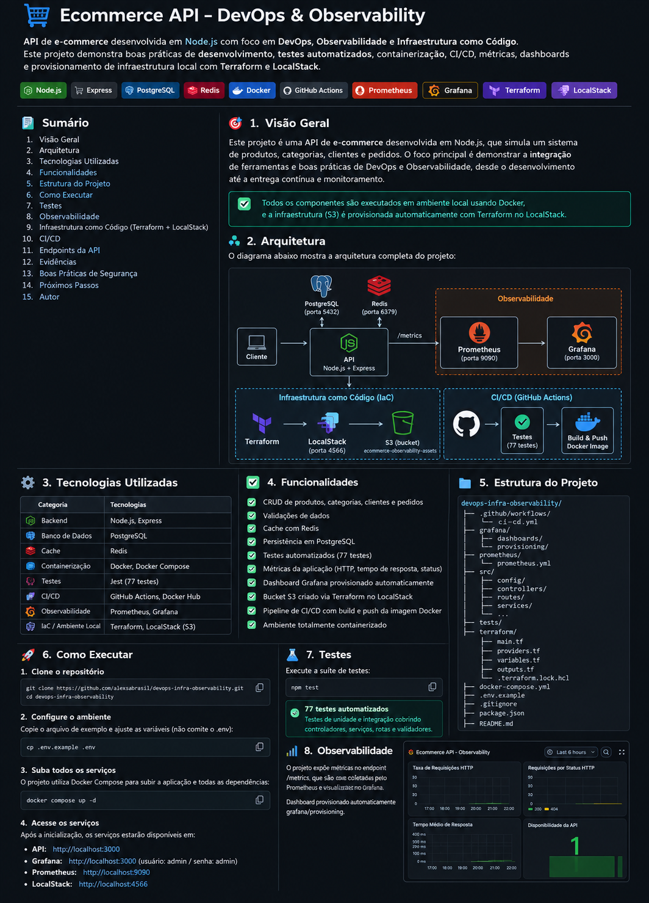

# 🛒 E-Commerce API | DevOps & Observability

<p align="center">
  <strong>API de e-commerce desenvolvida em Node.js com foco em DevOps, Observabilidade e Infraestrutura como Código.</strong>
</p>

<p align="center">
  Desenvolvimento • Testes • Docker • CI/CD • Observabilidade • IaC
</p>

<p align="center">
  
</p>

---

## 📌 Sobre o projeto

O **E-Commerce API | DevOps & Observability** é um projeto desenvolvido para demonstrar, de forma integrada, práticas modernas de desenvolvimento de software, automação, containerização, integração contínua, observabilidade e Infraestrutura como Código.

A aplicação simula uma API REST de e-commerce responsável pelo gerenciamento de recursos como **produtos, categorias, clientes e pedidos**.

Mais do que executar uma aplicação Node.js, o projeto demonstra todo o ciclo operacional ao redor dela:

- aplicação e dependências executadas em containers;
- persistência de dados com PostgreSQL;
- cache com Redis;
- testes automatizados com Jest;
- pipeline CI/CD com GitHub Actions;
- build e publicação de imagem Docker;
- métricas expostas pela própria API;
- coleta de métricas com Prometheus;
- visualização e monitoramento com Grafana;
- provisionamento automático do dashboard Grafana;
- infraestrutura AWS simulada localmente com LocalStack;
- provisionamento de recurso S3 utilizando Terraform.

---

## 🎯 Objetivo

O objetivo principal é construir um ambiente reproduzível no qual desenvolvimento, infraestrutura, automação e observabilidade façam parte do mesmo fluxo.

O projeto busca demonstrar conceitos relacionados a:

**DevOps • CI/CD • Containers • Observabilidade • Infrastructure as Code • Automação • Segurança de configuração**

---

## 🏗️ Arquitetura

A solução é composta por uma API Node.js integrada a PostgreSQL e Redis.

A API disponibiliza métricas no endpoint `/metrics`, coletadas periodicamente pelo Prometheus. O Grafana utiliza o Prometheus como Data Source para apresentar os indicadores em um dashboard.

Paralelamente, o Terraform utiliza o provider AWS direcionado ao LocalStack para provisionar infraestrutura AWS simulada localmente.

```text
                              ┌───────────────────────┐
                              │        Cliente        │
                              └───────────┬───────────┘
                                          │ HTTP
                                          ▼
                              ┌───────────────────────┐
                              │    E-Commerce API     │
                              │   Node.js + Express   │
                              │      porta 3000       │
                              └──────┬────────┬───────┘
                                     │        │
                       ┌─────────────┘        └─────────────┐
                       ▼                                    ▼
              ┌─────────────────┐                  ┌─────────────────┐
              │   PostgreSQL    │                  │      Redis      │
              │ container 5432  │                  │   porta 6379    │
              │ host 5433       │                  │      Cache      │
              └─────────────────┘                  └─────────────────┘

                         OBSERVABILIDADE
                                │
                         GET /metrics
                                │
                                ▼
                       ┌─────────────────┐
                       │   Prometheus    │
                       │   porta 9090    │
                       └────────┬────────┘
                                │
                                ▼
                       ┌─────────────────┐
                       │     Grafana     │
                       │   porta 3001    │
                       └─────────────────┘


                   INFRAESTRUTURA COMO CÓDIGO

              ┌─────────────────┐
              │    Terraform    │
              └────────┬────────┘
                       │ AWS Provider
                       ▼
              ┌─────────────────┐
              │   LocalStack    │
              │   porta 4566    │
              └────────┬────────┘
                       │
                       ▼
              ┌──────────────────────────────┐
              │ S3                          │
              │ ecommerce-observability-    │
              │ assets                      │
              └──────────────────────────────┘


                         CI/CD

        Push → GitHub Actions → Testes → Docker Build → Docker Hub
```

---

## ⚙️ Tecnologias utilizadas

| Categoria | Tecnologias |
|---|---|
| Backend | Node.js, Express |
| Banco de dados | PostgreSQL |
| Cache | Redis |
| Testes | Jest |
| Containerização | Docker, Docker Compose |
| CI/CD | GitHub Actions |
| Registry | Docker Hub |
| Métricas | prom-client |
| Monitoramento | Prometheus |
| Visualização | Grafana |
| IaC | Terraform |
| AWS local | LocalStack |
| Cloud simulada | Amazon S3 |
| Documentação da API | Swagger |

---

## ✨ Funcionalidades

A aplicação possui estrutura para gerenciamento dos principais recursos de um e-commerce, incluindo:

- produtos;
- categorias;
- clientes;
- pedidos;
- validação dos dados recebidos;
- persistência com PostgreSQL;
- cache com Redis;
- documentação da API com Swagger;
- health check da aplicação;
- métricas de observabilidade;
- testes automatizados.

Além das funcionalidades da API, o projeto implementa uma camada completa de DevOps e observabilidade.

---

## 📂 Estrutura do projeto

```text
devops-infra-observability/
│
├── .github/
│   └── workflows/
│       └── ci-cd.yml
│
├── grafana/
│   ├── dashboards/
│   │   └── ecommerce-observability.json
│   └── provisioning/
│       ├── dashboards/
│       │   └── dashboards.yml
│       └── datasources/
│           └── prometheus.yml
│
├── prometheus/
│   └── prometheus.yml
│
├── src/
│   ├── cache/
│   ├── config/
│   ├── controllers/
│   ├── database/
│   ├── repositories/
│   ├── routes/
│   ├── services/
│   ├── validators/
│   ├── app.js
│   └── server.js
│
├── terraform/
│   ├── .terraform.lock.hcl
│   ├── main.tf
│   ├── outputs.tf
│   ├── providers.tf
│   └── variables.tf
│
├── tests/
│   ├── unit/
│   └── setup.js
│
├── .dockerignore
├── .env.example
├── .gitignore
├── docker-compose.yml
├── Dockerfile
├── jest.config.js
├── package.json
├── package-lock.json
└── README.md
```

---

# 🚀 Como executar

## 1. Pré-requisitos

Para executar o projeto localmente, é necessário ter instalado:

- Git
- Docker
- Docker Compose
- Terraform

O LocalStack será executado através do Docker Compose.

---

## 2. Clone o repositório

```bash
git clone https://github.com/alexsabrasil/devops-infra-observability.git
cd devops-infra-observability
```

---

## 3. Configure as variáveis de ambiente

Crie seu arquivo `.env` utilizando o arquivo de exemplo:

### Linux/macOS

```bash
cp .env.example .env
```

### PowerShell

```powershell
Copy-Item .env.example .env
```

Preencha as variáveis necessárias no `.env`.

Exemplo de estrutura:

```env
NODE_ENV=development
PORT=3000

DB_HOST=localhost
DB_PORT=5433
DB_NAME=ecommerce
DB_USER=ecommerce
DB_PASSWORD=

DB_POOL_MIN=2
DB_POOL_MAX=10

REDIS_HOST=localhost
REDIS_PORT=6379
REDIS_PASSWORD=
REDIS_DB=0

RATE_LIMIT_WINDOW_MS=900000
RATE_LIMIT_MAX_REQUESTS=100

LOCALSTACK_AUTH_TOKEN=
```

> [!IMPORTANT]
> O arquivo `.env` contém configurações locais e possíveis credenciais e, por isso, **não deve ser enviado ao repositório**.
>
> O projeto mantém apenas `.env.example` versionado.

Para versões atuais do LocalStack que utilizem autenticação, informe seu próprio `LOCALSTACK_AUTH_TOKEN` no `.env`.

---

## 4. Suba o ambiente

```bash
docker compose up -d
```

Confira os serviços:

```bash
docker compose ps
```

A stack contém:

| Serviço | Porta |
|---|---:|
| E-Commerce API | 3000 |
| PostgreSQL | 5433 → 5432 |
| Redis | 6379 |
| Prometheus | 9090 |
| Grafana | 3001 → 3000 |
| LocalStack | 4566 |

---

# 🌐 Endpoints principais

## API

```text
http://localhost:3000
```

## Health Check

```text
http://localhost:3000/health
```

Exemplo:

```bash
curl http://localhost:3000/health
```

---

## Métricas

```text
http://localhost:3000/metrics
```

As métricas são disponibilizadas em formato compatível com Prometheus.

---

## Swagger

A documentação interativa da API está disponível em:

```text
http://localhost:3000/api-docs/
```

---

# 🧪 Testes automatizados

Os testes utilizam **Jest**.

Execute:

```bash
npm test
```

Estado validado durante o desenvolvimento:

```text
Test Suites: 6 passed, 6 total
Tests:       77 passed, 77 total
```

Os testes fazem parte da pipeline de CI/CD e são executados antes da construção e publicação da imagem Docker.

---

# 🐳 Docker

A API possui imagem própria definida pelo `Dockerfile`.

Exemplo de build local:

```bash
docker build -t ecommerce-api:1.0 .
```

A execução completa do ambiente é realizada pelo Docker Compose:

```bash
docker compose up -d
```

Para verificar os containers:

```bash
docker compose ps
```

Para visualizar logs:

```bash
docker compose logs -f
```

Para interromper os serviços sem remover os volumes:

```bash
docker compose stop
```

---

# 🔄 CI/CD

O projeto utiliza **GitHub Actions** para automatizar validações e publicação da imagem Docker.

Workflow:

```text
.github/workflows/ci-cd.yml
```

O fluxo implementado é:

```text
Push na main
      │
      ▼
Checkout
      │
      ▼
Setup Node.js
      │
      ▼
Instalação das dependências
      │
      ▼
Testes automatizados
      │
      ▼
Login no Docker Hub
      │
      ▼
Docker Build
      │
      ▼
Push da imagem
```

A pipeline utiliza uma estratégia de **fail fast**: o processo de build e publicação somente prossegue quando os testes são concluídos com sucesso.

Durante a validação final do projeto, a pipeline executou com sucesso os jobs:

```text
Test
Build and Push Docker Image
```

---

# 📈 Observabilidade

A camada de observabilidade utiliza:

```text
API → Prometheus → Grafana
```

A aplicação utiliza `prom-client` para disponibilizar métricas no endpoint:

```text
/metrics
```

Entre as métricas utilizadas estão:

```text
ecommerce_http_requests_total
ecommerce_http_request_duration_seconds
```

O Prometheus coleta essas métricas periodicamente.

Arquivo de configuração:

```text
prometheus/prometheus.yml
```

---

## Prometheus

Interface:

```text
http://localhost:9090
```

O target configurado é:

```text
ecommerce-api
```

com coleta em:

```text
api:3000/metrics
```

Quando a comunicação está funcionando corretamente, o target é apresentado como:

```text
UP
```

---

# 📊 Grafana

Interface:

```text
http://localhost:3001
```

O Prometheus é configurado automaticamente como Data Source através de:

```text
grafana/provisioning/datasources/prometheus.yml
```

O dashboard também é provisionado automaticamente:

```text
grafana/dashboards/ecommerce-observability.json
```

e:

```text
grafana/provisioning/dashboards/dashboards.yml
```

Dashboard:

```text
E-Commerce API - Observability Dashboard
```

Ele contém quatro indicadores principais.

### Taxa de Requisições HTTP

```promql
sum(rate(ecommerce_http_requests_total[1m]))
```

Monitora a taxa de requisições recebidas pela API.

### Requisições por Status HTTP

```promql
sum by (status_code) (
  rate(ecommerce_http_requests_total[1m])
)
```

Permite acompanhar respostas como `200` e `404`.

### Tempo Médio de Resposta

```promql
sum(rate(ecommerce_http_request_duration_seconds_sum[1m]))
/
sum(rate(ecommerce_http_request_duration_seconds_count[1m]))
```

Monitora a duração média das requisições processadas.

### Disponibilidade da API

```promql
up{job="ecommerce-api"}
```

O valor:

```text
1
```

indica que o Prometheus está conseguindo coletar as métricas da API.

---

# 🏗️ Infraestrutura como Código

O projeto utiliza **Terraform** para provisionar recursos AWS simulados através do **LocalStack**.

Arquivos:

```text
terraform/
├── .terraform.lock.hcl
├── main.tf
├── outputs.tf
├── providers.tf
└── variables.tf
```

O provider AWS é direcionado ao endpoint local do LocalStack:

```text
http://localhost:4566
```

Dessa forma, é possível demonstrar Infrastructure as Code sem criar recursos na conta AWS real.

---

# ☁️ LocalStack + Amazon S3

O LocalStack é executado como parte do Docker Compose.

Endpoint:

```text
http://localhost:4566
```

O Terraform provisiona o bucket:

```text
ecommerce-observability-assets
```

Além da criação do bucket, o projeto habilita **versionamento do S3**.

Os recursos Terraform gerenciados são:

```text
aws_s3_bucket.ecommerce_assets
aws_s3_bucket_versioning.ecommerce_assets
```

---

## Executando o Terraform

Inicialize:

```bash
terraform -chdir=terraform init
```

Formate:

```bash
terraform -chdir=terraform fmt
```

Valide:

```bash
terraform -chdir=terraform validate
```

Visualize o plano:

```bash
terraform -chdir=terraform plan
```

Aplique:

```bash
terraform -chdir=terraform apply
```

Confirme digitando:

```text
yes
```

Após o provisionamento:

```bash
terraform -chdir=terraform state list
```

Resultado esperado:

```text
aws_s3_bucket.ecommerce_assets
aws_s3_bucket_versioning.ecommerce_assets
```

Consulte os outputs:

```bash
terraform -chdir=terraform output
```

Exemplo:

```text
bucket_arn  = "arn:aws:s3:::ecommerce-observability-assets"
bucket_name = "ecommerce-observability-assets"
```

---

## ♻️ Idempotência

Após a criação da infraestrutura, uma nova execução de:

```bash
terraform -chdir=terraform plan
```

deve identificar que o ambiente já corresponde à configuração declarada:

```text
No changes. Your infrastructure matches the configuration.
```

Isso demonstra uma das propriedades fundamentais da Infraestrutura como Código: o Terraform mantém e compara o **estado desejado** com o **estado atual** da infraestrutura.

---

# 🔐 Boas práticas de segurança

O projeto adota cuidados para evitar a exposição de informações sensíveis.

Entre as medidas implementadas:

- `.env` não versionado;
- `.env.example` sem senha real;
- senha do PostgreSQL obtida através de variável de ambiente;
- `LOCALSTACK_AUTH_TOKEN` obtido através de variável de ambiente;
- token do LocalStack não armazenado no `docker-compose.yml`;
- credenciais do Docker Hub armazenadas como GitHub Actions Secrets;
- arquivos `terraform.tfstate` ignorados pelo Git;
- diretório `.terraform/` ignorado;
- `.terraform.lock.hcl` versionado para aumentar a reprodutibilidade do ambiente.

Exemplo utilizado no Compose:

```yaml
LOCALSTACK_AUTH_TOKEN=${LOCALSTACK_AUTH_TOKEN}
```

O valor da credencial permanece somente no ambiente local.

---

# 📁 Arquivos locais ignorados

Entre os arquivos que não devem ser enviados ao Git estão:

```text
.env
node_modules/
coverage/
dist/
*.log
**/.terraform/*
*.tfstate
*.tfstate.*
*.tfplan
```

O Terraform lock file é intencionalmente versionado:

```text
terraform/.terraform.lock.hcl
```

---

# 🔍 Fluxo completo do projeto

```text
                         DESENVOLVIMENTO
                               │
                               ▼
                       Node.js + Express
                               │
                   ┌───────────┴───────────┐
                   ▼                       ▼
              PostgreSQL                 Redis
                   │
                   ▼
                 Testes
                   │
                   ▼
                  Git
                   │
                   ▼
             GitHub Actions
                   │
              Testes automatizados
                   │
                   ▼
              Docker Build
                   │
                   ▼
               Docker Hub


                         OBSERVABILIDADE

                       E-Commerce API
                              │
                           /metrics
                              │
                              ▼
                         Prometheus
                              │
                              ▼
                           Grafana


                    INFRAESTRUTURA COMO CÓDIGO

                          Terraform
                              │
                              ▼
                       AWS Provider
                              │
                              ▼
                         LocalStack
                              │
                              ▼
                        Amazon S3
```

---

# ✅ Validações realizadas

Durante a implementação foram validados:

- aplicação executando em container;
- PostgreSQL operacional;
- Redis operacional;
- health check da API;
- endpoint `/metrics`;
- Swagger;
- 77 testes automatizados;
- pipeline GitHub Actions;
- build da imagem Docker;
- publicação da imagem;
- Prometheus coletando métricas;
- target da API em estado `UP`;
- Grafana conectado ao Prometheus;
- dashboard com métricas HTTP;
- provisionamento automático do Grafana;
- LocalStack operacional;
- Terraform validado;
- Terraform Plan;
- Terraform Apply;
- criação do bucket S3;
- versionamento do bucket;
- Terraform State;
- Terraform Outputs;
- idempotência com `No changes`;
- remoção de senha hardcoded antes da entrega.

---

# 💡 Conceitos aplicados

O projeto permite demonstrar na prática conceitos importantes do ciclo DevOps:

**Automação**

Redução de tarefas manuais através de pipeline, Docker Compose, provisionamento Grafana e Terraform.

**Reprodutibilidade**

Ambiente descrito através de código e arquivos de configuração versionados.

**Observabilidade**

A aplicação não apenas executa: ela disponibiliza dados sobre seu próprio comportamento.

**Infrastructure as Code**

A infraestrutura simulada é criada de forma declarativa pelo Terraform.

**Continuous Integration**

Cada alteração enviada para a branch principal passa pelos testes automatizados.

**Continuous Delivery**

Após a validação, a pipeline constrói e publica a imagem Docker.

**Segurança de configuração**

Segredos e credenciais são separados do código versionado.

---

# 📚 Aprendizados

O desenvolvimento deste projeto permitiu integrar tecnologias que normalmente são estudadas separadamente.

A aplicação tornou-se o centro de um ecossistema que envolve código, testes, containers, automação, infraestrutura e monitoramento.

Um dos principais aprendizados foi compreender que DevOps não se resume à utilização de ferramentas. O valor está na integração entre elas para criar um processo mais **automatizado, reproduzível, observável e seguro**.

---

# 👥 Equipe

Projeto desenvolvido em equipe como atividade prática de DevOps e Observabilidade.

**Integrantes**

- Alexsandra Tavares
- Vinicius
- Carlos

> Os nomes completos dos integrantes podem ser adicionados conforme os dados utilizados na entrega acadêmica.

---

# 📌 Status do projeto

```text
API                     ✅
PostgreSQL              ✅
Redis                   ✅
Docker                  ✅
Docker Compose          ✅
Testes automatizados    ✅
CI/CD                   ✅
Docker Hub              ✅
Prometheus              ✅
Grafana                 ✅
Terraform               ✅
LocalStack              ✅
Amazon S3 simulado      ✅
Hardening               ✅
```

**Status: implementação concluída.**

---

<p align="center">
  <strong>E-Commerce API | DevOps & Observability</strong>
</p>

<p align="center">
  Desenvolvimento • Automação • Infraestrutura • Observabilidade
</p>